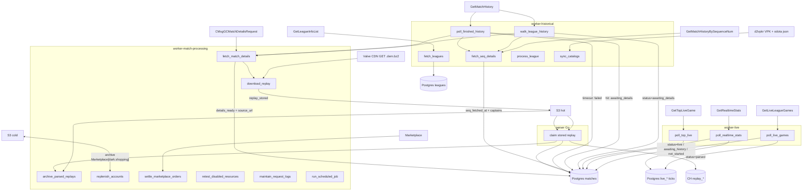
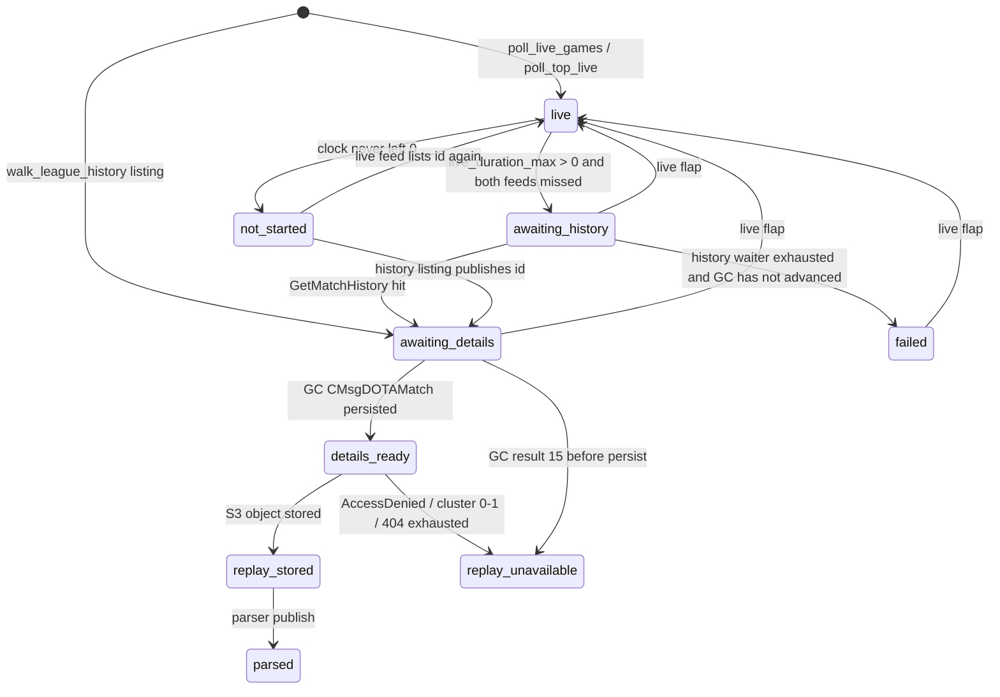

# Job graph

Русский обзор (две таблицы: пайплайн матча и прочие джобы):
[`job-graph-ru.md`](./job-graph-ru.md).

Companions: [`worker-architecture.md`](./worker-architecture.md)
(roles, queues, retries), [`data-schema.md`](./data-schema.md)
(columns), [`request-logs.md`](./request-logs.md) (Valve attempt
tables), [`replay-parser.md`](./replay-parser.md) (Go poller).

Every graphile-worker identifier in `packages/worker/src/roles.ts`
plus the Go parser poller. Graphile tables are the queue; match
truth lives on `matches.status` and
`match_replays.status`.

Valve Web API / GC / CDN attempts also insert one row into
`steam_api_requests`, `steam_gc_requests`, or `replay_requests`
when `settings.log_valve_requests` is true. Those are operational
logs, not match facts.

---

## Match pipeline



`run_scheduled_job` is registered on **every** role. Named-queue
work with a future `runAt` parks as this hop (no `queue_name`);
when due it enqueues back onto `details:*` / `seq:*` /
`replay-live:*` / `replay-historical:*`.

`process_league` is a registered task that calls the same
`runWalkLeagueHistory({ reset: true })` as a forced walk. The HTTP
kick `POST /api/leagues/process-finished` currently enqueues
`walk_league_history` with `reset: true` and `jobKey = walk:{league_id}`,
not `process_league`.

---

## `matches.status`



| Status | Set by |
|---|---|
| `live` | `poll_live_games`, `poll_top_live`, `poll_realtime_stats` (`touchMatchLive`) |
| `awaiting_history` | live finish detection (`live_duration_max > 0`) |
| `not_started` | live finish detection (clock stayed 0); `last_error_kind = not_started` |
| `awaiting_details` | `walk_league_history` listing, `poll_finished_history` hit |
| `details_ready` | `fetch_match_details` GC persist |
| `replay_stored` | `download_replay` S3 write |
| `parsed` | parser `Publish` |
| `replay_unavailable` | GC AccessDenied, unpublished CDN (cluster 0/1), 404 budget exhausted; `last_error_kind = unavailable` |
| `failed` | history waiter exhausted while still `awaiting_history`; `last_error_kind = history_timeout`. If GC / replay already moved the row forward, the waiter stops without rewriting status |

Later statuses (`details_ready`, `awaiting_replay`, `replay_stored`,
`replay_unavailable`, `parsed`) are **not** pulled back to `live`.
`not_started` / `awaiting_history` / `awaiting_details` / `failed`
flap back if either live feed lists the id again.

`awaiting_replay` exists on the enum and is written by CLI stubs;
the ingest path jumps `details_ready` → `replay_stored`.

---

## `match_replays.status`

```
pending → downloading → stored → parsing → parsed
                 ↘ unavailable
                 ↘ failed
```

| Status | Set by |
|---|---|
| `pending` | `ensureReplayRow` (details / download start); 404 retry |
| `downloading` | `download_replay` after CDN GET starts |
| `stored` | `download_replay` S3 write (or object already there); parser reclaim of stale `parsing` (> 30 min) |
| `parsing` | parser claim (`FOR UPDATE SKIP LOCKED`) |
| `parsed` | parser publish (ClickHouse + Postgres commit) |
| `unavailable` | GC result 15, `replay_state` notRecorded/expired, cluster 0/1, 404 exhausted |
| `failed` | no usable GC account; non-404 CDN/S3 error (job then retries off-queue) |

Archive does **not** change `status` or `matches.status`. It sets
`archived_at` and rewrites `s3_bucket` / `s3_key` to the cold
object.

---

## Who starts whom

| Trigger | Job |
|---|---|
| worker boot (`startupJobsFor`) | live polls + `poll_finished_history` (live and historical roles), `fetch_leagues`, `walk_league_history`, `archive_parsed_replays`, `maintain_request_logs`, `replenish_accounts`, `settle_marketplace_orders`, `retest_disabled_resources` |
| cron (every role) | `ensure_loop_jobs` every minute: re-enqueue a self-reschedule `jobKey` that is missing or permafailed (`locked_at` null and `attempts >= max_attempts`). Does not touch a scheduled or in-flight row. |
| cron (historical / `all` only) | `fetch_leagues` hourly; `walk_league_history` 5 min watchdog (`preserve_run_at`); `sync_catalogs` 05:00 UTC |
| historical boot (sync, before ingest) | `runSyncCatalogsOnBoot` (not a graphile job) |
| self-reschedule | live polls (`live_poll_interval_ms`), `poll_finished_history` (`history_fast_poll_ms`), walk (`steam_api_min_interval_ms`), archive / replenish / settle / retest / request-log maintain |
| live finish (`live_duration_max > 0`) | `fetch_match_details` origin `live` (GC starts in parallel with history; waiter stays armed until a seqnum or timeout) |
| `poll_finished_history` hit | `fetch_seq_details` + `fetch_match_details` origin `live`, priority 0. Status already past `awaiting_details` is kept |
| `walk_league_history` listed rows | `fetch_seq_details` when `seq_fetched_at` is null |
| `walk_league_history` pending rows | `fetch_match_details` (live first, then `leagues.tier` desc, `start_time` desc), cap `history_details_enqueue_limit` |
| `fetch_match_details` success | `download_replay` unless already on hot/cold S3 (live delayed to `replay_available_at`) |
| `download_replay` 404 with budget left | `download_replay` again at `replayBackoffMs` |
| `POST /api/leagues/process-finished` | `walk_league_history` with `reset: true` |
| named-queue throw | `run_scheduled_job` then hop back (30 s, 1 m, 3 m, …) |

Queues: `details:{match_id % 5}` (max 5), `seq:{match_id % 5}` (max 5,
parallel with details), `replay-live:{% 10}` and
`replay-historical:{% 10}` (ten each). Priority: live 0, historical
details / seq 10, walk / historical replay 20, replenish 15, settle
orders 16, retest 25, archive 30, request-log maintain 40.

---

## Live

### `poll_live_games`

**Cadence.** Boot + every `settings.live_poll_interval_ms` (seed 2 s),
`jobKey = poll_live_games`. `maxAttempts = 25` (not 1): a Postgres crash
that kills both the poll and the `finally` reschedule is retried after
graphile reconnects. `ensure_loop_jobs` (LISTEN recovery + 1 min cron)
re-enqueues the key if the row is missing or permafailed.

**Calls.** `IDOTA2Match_570/GetLiveLeagueGames/v1` via `getLiveLeagueGames`.
Writes `steam_api_requests` (`method_name = GetLiveLeagueGames`).
Sets cursor `next_live_poll_at`. Does **not** enqueue details or download.

**Postgres.**

- `ensureLeagueStub` for each `league_id > 0` (`leagues.status = LIVE` if new).
- Unchanged scoreboard hash: `noteLiveFeedSeen` (still flaps
  `not_started` / `awaiting_history` / `awaiting_details` / `failed`
  back to `live`; resets that feed’s miss counter).
- Changed hash: `touchMatchLive` — upsert `matches` (`status = live`,
  `source = live` sticky, `ingest_sources += GetLiveLeagueGames`,
  series / teams / lobby / logos / stream delay).
  `upsertSeriesForMatch`, `upsertTeam`, `upsertMatchPlayers` (roster +
  scoreboard KDA/items), `upsertPlayer`, `replaceMatchDraft` (picks/bans
  from scoreboard).
- `noteLiveClock` → `live_duration_max = GREATEST(...)`.
- Non-empty list: `noteLiveFeedMisses` increments
  `live_league_missed_polls` for `status = live` rows that carry this
  ingest source and are absent. Empty list: **no** miss increment.
- `finishMissingLiveMatches` when **every** feed that listed the id
  has crossed `live_missing_threshold`:
  - `live_duration_max > 0` → `status = awaiting_history`,
    `finished_at = now()`,
    `replay_available_at = now() + replay_live_delay_ms`,
    `history_next_poll_at = now()`.
    Enqueue `fetch_match_details` origin `live` so GC runs while
    history is still looking for the seqnum.
  - else → `status = not_started`, `last_error_kind = not_started`.

**Postgres ticks.** Every listed game, even if the hash was unchanged:

- `live_match_ticks` (`source = GetLiveLeagueGames`) — duration, scores,
  towers, barracks, roshan timer, series, spectators, lobby ids.
- `live_player_ticks` — KDA, farm, items 0–5, position, ultimates,
  respawn.

---

### `poll_top_live`

**Cadence.** Same interval, `jobKey = poll_top_live`. Same retry /
`ensure_loop_jobs` recovery as `poll_live_games`.

**Calls.** `IDOTA2Match_570/GetTopLiveGame/v1` (`partner=0`) via
`getTopLiveGames`. Log method `GetTopLiveGame`. Cursor
`next_top_live_poll_at`. Keep `league_id > 0` only.

**Postgres.**

- `ensureLeagueStub` + `touchMatchLive` with `ingest = GetTopLiveGame`.
  Always touches (no hash short-circuit). Writes `server_steam_id`
  (Steam uint64 as decimal text). Fields this feed does not have
  (series, team names, lobby, logos) are SQL NULL so
  `COALESCE(excluded, matches)` keeps GetLiveLeagueGames values.
- Miss counter `top_live_missed_polls`. Same finish rule as live poll.
- Same live flap on sighting.

**ClickHouse.** None. Unlocks `poll_realtime_stats` by filling
`server_steam_id`.

---

### `poll_realtime_stats`

**Cadence.** Same interval. Does not enqueue other jobs. Same retry /
`ensure_loop_jobs` recovery as `poll_live_games`.

**Calls.** `IDOTA2MatchStats_570/GetRealtimeStats/v1` for
`status = live AND server_steam_id IS NOT NULL`, oldest
`last_realtime_at` first, until `live_poll_interval_ms` elapses
(leftovers wait for the next tick). Each call goes through the 1 rps
key limiter. Log method `GetRealtimeStats`, `match_id` set.

**Postgres.**

- `touchMatchLive` (ingest still `GetTopLiveGame` — this feed does
  not add a third ingest source), teams, players, optional draft.
- `touchRealtimeSeen` → `last_realtime_at`.
- `noteLiveClock` from `game_time`.
- `league_id <= 0` or `PublicMatchError` → `clearServerSteamId`, stop
  scanning that id.

**Postgres ticks.**

- `live_match_ticks` (`source = GetRealtimeStats`) — `game_time`,
  scores, `game_state`, `server_steam_id`.
- `live_player_ticks` — KDA, gold, net worth, items 0–8, x/y.

---

## Historical

### `fetch_leagues`

**Cadence.** Startup + cron `0 * * * *`. CLI `bun run leagues:fetch`.

**Calls.** `GetLiveLeagueGames` and `GetTopLiveGame` (best-effort, to
collect live `league_id`s), then
`https://www.dota2.com/webapi/IDOTA2League/GetLeagueInfoList/v001`.
Log methods `GetLiveLeagueGames`, `GetTopLiveGame`, `GetLeagueInfoList`.

**Postgres.** `upsertLeagues` — Valve name/tier/region/prize/window/
`valve_status`, plus derived `leagues.status`:

1. `LIVE` if the id is in either live feed
2. else `UPCOMING` if `now < start_timestamp`
3. else `FINISHED` if `now > end_timestamp` or `valve_status = 5` or
   `most_recent_activity` older than 14 days
4. else `LIVE` only inside `[start, end]`

Does not touch matches.

---

### `walk_league_history`

**Cadence.** Boot + self-requeue every `steam_api_min_interval_ms` on
`jobKey = walk_league_history`. 5-minute cron is a watchdog
(`preserve_run_at`); `ensure_loop_jobs` also revives a permafailed key.
Payload may pin `league_id` while older pages remain.

**Calls.** One `IDOTA2Match_570/GetMatchHistory/v1` page
(`league_id`, `matches_requested = history_page_size`, optional
`start_at_match_id`). Discovery listing. Listed rows with a seqnum enqueue
`fetch_seq_details`. Log method `GetMatchHistory`.

**Postgres.**

- `leagues`: `history_head_match_id` / `history_tail_match_id` /
  `last_match_seq_num` / `history_exhausted` / `history_checked_at`.
  Empty newest page sets `history_exhausted`. Empty/exhausted league
  is not self-requeued as the same id; next tick
  `pickNextHistoryLeague` (`tier` desc, then newest activity).
- Listed matches: `upsertHistoryMatches` — insert
  `status = awaiting_details`, `source = historical`,
  `ingest_sources = {GetMatchHistory}`. On
  conflict: keep `live` / later statuss; promote
  `discovered` / `awaiting_history` / `not_started` to
  `awaiting_details`. Sticky `source = live` if already live.
  Teams, series, `match_players` (account/hero/slot), `players`.
- Then enqueue `fetch_match_details` for rows with
  `details_fetched_at IS NULL` and status in
  (`discovered`, `awaiting_details`), live origin first, capped by
  `history_details_enqueue_limit` minus in-flight historical details
  jobs (including delayed hops).

**ClickHouse.** None.

---

### `poll_finished_history`

**Cadence.** Boot + every `history_fast_poll_ms` (seed 5 s). Same retry /
`ensure_loop_jobs` recovery as `poll_live_games`.

**Calls.** Page `GetMatchHistory` per due `league_id` that has an armed
waiter (`history_next_poll_at IS NOT NULL`, `match_seq_num IS NULL`,
`history_next_poll_at <= now()`), until waiting ids are found or the
league is exhausted (Valve page size 100). Not gated on `matches.status`
— GC / replay may already be `details_ready` / `parsed`. Log method
`GetMatchHistory`. Replay delay is **not** applied here.

**Postgres.**

- Hit: listing fields, `ingest_sources += GetMatchHistory`,
  `match_seq_num`, `history_next_poll_at = NULL`. Promote
  `awaiting_history` / `not_started` / `discovered` / `failed` to
  `awaiting_details`; later statuses stay. Players/teams/series.
  Enqueue `fetch_seq_details` and `fetch_match_details` origin `live`.
- Miss: bump `history_poll_fast_count` then `history_poll_slow_count`
  (`history_fast_poll_limit` seed 720 / 60 min at 5 s, then
  `history_slow_poll_limit` seed 180 / 3 h at 60 s). After both:
  clear `history_next_poll_at`. Only if status is still
  `awaiting_history`: `status = failed`, `last_error_kind = history_timeout`.

**ClickHouse.** None.

---

### `process_league`

**Cadence.** On demand (`payload.league_id`, optional `matches_limit`).

**Calls.** `runWalkLeagueHistory({ leagueId, matchesLimit, reset: true })`
— same Steam call and writes as `walk_league_history`, after
`resetLeagueHistory` (clears exhausted / cursors).

---

### `sync_catalogs`

**Cadence.** Historical boot (blocking if `heroes` is empty) + cron
`0 5 * * *`. CLI `bun run catalogs:sync`.

**Calls.** Builds the same snapshot as odota/dotaconstants
`tasks/updateconstants.ts`: Valve VPK dumps from
[dotabuff/d2vpkr](https://github.com/dotabuff/d2vpkr)
(`npc_heroes` `#base` includes, per-hero files with
`AbilityDefinitions`, `items`, `npc_ability_ids`, `regions`,
English localization). Manual tables (`patch`, `game_mode`,
`lobby_type`, `permanent_buffs`, `xp_level`) come from
odota/dotaconstants `json/`. `cluster` is the leftover
`build/cluster.json` (their generator is commented out; it
used Stratz). No OpenDota `/api/constants` fetch.

**Postgres (replace catalogs, not match rows).** `heroes`, `items`,
`abilities`, `patches`, `game_modes`, `lobby_types`, `regions`,
`clusters`, `permanent_buffs`, `xp_levels`, `hero_abilities`,
`hero_facets`. Failed boot keeps last good rows unless `heroes` is
empty.

---

## Match processing

### `fetch_seq_details`

**Cadence.** On demand after a seqnum is known. Queue `seq:{match_id % 5}`,
`jobKey = seq:{matchId}`. Live priority 0, historical 10.
Max attempts 5 (retries hop via `run_scheduled_job`, same delays as GC).

**Calls.** `IDOTA2Match_570/GetMatchHistoryBySequenceNum/v1`
(`start_at_match_seq_num`, `matches_requested = 1`).
Log method `GetMatchHistoryBySequenceNum`, `match_id` set.

**Postgres.**

- Skip when `seq_fetched_at` is already set.
- Missing `match_seq_num`: throw (retry).
- Empty window: throw (retry).
- Valve returned a later global match and skipped ours: warn, return.
- Success: `persistMatchRecord(..., fetched: 'seq', skipStoryObjectives: true)`
  — fills missing match / player / draft / coach / broadcaster facts
  only. If GC or seq already wrote the row, existing non-null values
  stay (first post-game source may overwrite live KDA/items). Draft:
  replace an incomplete live stub, then never replace a complete
  sequence. Objectives are additive (no DELETE).
  `seq_fetched_at`, `ingest_sources += GetMatchHistoryBySequenceNum`.
- Does **not** enqueue download (no salt).

**ClickHouse.** None.

### `fetch_match_details`

**Cadence.** On demand. Queue `details:{match_id % 5}`,
`jobKey = details:{matchId}`. Live priority 0, historical 10.
Max attempts 5 (retries hop via `run_scheduled_job`).

**Calls.** If cluster/salt/`source_url` already on `match_replays`,
skip GC. Then skip download when the replay is already `parsed` /
`parsing`, or the `.dem.bz2` is already on hot or cold S3
(`adoptExistingReplayObject`). Cluster 0/1 (unpublished CDN) is
`unavailable` only after that miss. Otherwise Dota GC
`CMsgGCMatchDetailsRequest` /
`CMsgGCMatchDetailsResponse` (`sendGcMatchDetailsRequest`). Log
`steam_gc_requests.method_name = CMsgGCMatchDetailsRequest`.
No Web API. `match_seq_num` is **not** taken from GC.

**Postgres.**

- `ensureReplayRow` (`status = pending`, priority live sticky).
- Copy `cluster` / `replay_salt` from `matches` if missing.
- GC result 15 (`AccessDenied`): `match_replays.status = unavailable`,
  `matches.status = replay_unavailable`, `last_error_kind = unavailable`.
  Job **succeeds** (must not hold the shard).
- `replay_state` notRecorded / expired: replay `unavailable`, no
  match-status change in that branch.
- Success: `persistMatchRecord(..., fetched: 'gc', skipStoryObjectives: true)`
  - `matches`: box score, draft fields, logos, `cluster` / `replay_salt`,
    `details_fetched_at = now()`, `status = details_ready` (unless already
    past that). Historical sets
    `replay_available_at = now()` if null.
  - `match_players` plus child `match_player_buffs`,
    `match_player_units`, `match_player_ability_upgrades`,
    `match_player_damage_breakdown`.
  - `players`, `teams`, `series`, `match_draft` / `match_coaches` /
    `match_broadcasters` are additive (first complete draft may
    replace a live stub; later writes fill nulls only). Objectives
    skipped here; parser inserts missing story rows without DELETE.
- Then `match_replays.source_url = replayUrl(cluster, match_id, salt)`,
  store GC account/proxy ids.
- No cluster/salt yet: re-enqueue self in 60 s.
- No usable GC account: replay `failed`, return (no throw).
- Other GC results: throw → off-queue retry.

**Enqueue.** `download_replay` unless already `parsed` / `parsing` or
the object is already on hot or cold S3. Live:
`runAt = replay_available_at` if still in the future. Historical:
immediate, subject to `history_replay_enqueue_limit`.

**ClickHouse.** None.

---

### `download_replay`

**Cadence.** After details stored a URL. Queues `replay-live:{% 10}`
or `replay-historical:{% 10}`. `jobKey = replay:{matchId}`.

**Calls.** `GET {source_url}` (Valve CDN `.dem.bz2`, 10 min timeout)
then `s3.write`. Log `replay_requests.method_name = GetReplay`
(skipped when the object is already in S3 or the host is unpublished —
no Valve request). No GC.

**Postgres / S3.**

- Object already in hot storage or at the cold archive locator: no
  Valve GET (`adoptExistingReplayObject`). `parsed` / `parsing`
  stay put. Otherwise `match_replays.status = stored`, locator
  pointed at that object, `matches.status = replay_stored`. Hot hit
  `clearArchived`; cold hit keeps `archived_at`. Parser claims
  `stored` on its own. `fetch_match_details` uses the same helper
  before enqueueing or marking unpublished.
- Missing URL and no object: throw (details must run first).
- Cluster 0/1 or unpublished host: `unavailable`,
  `matches.status = replay_unavailable`.
- Else `status = downloading`, stream to S3, then `stored` + bytes +
  `stored_at`, status `replay_stored`.
- HTTP 404: bump `attempts`; if `replayBackoffMs` still has budget
  (`1 m`, `1 m`, `3 m × 20`, `1 h × 24`) → `pending`,
  `next_attempt_at`, re-enqueue; else `unavailable` /
  `replay_unavailable`.
- Other HTTP/S3 errors: replay `failed`, throw (hop retry).

**ClickHouse.** None. Parse is the next process.

---

### `archive_parsed_replays`

**Cadence.** Boot + every `replay_archive_interval_ms` (seed 30 s),
or immediately if the batch was full. Priority 30.

**Calls.** S3 copy (GCS→GCS server-side rewrite; otherwise stream)
then delete the hot object. Destination from `S3_ARCHIVE_*` env, not
`settings`. Skips if destination would be the same bucket+key.

**Postgres.** Rows with `status = parsed AND archived_at IS NULL`:
rewrite `s3_bucket` / `s3_key`, set `archived_at`. Phase and replay
status stay `parsed`. Copy/delete failure writes `last_error` only.

---

### `replenish_accounts`

**Cadence.** Boot + `replenish_interval_ms`. Priority 15.

**Calls.** If ready API keys or dedicated GC accounts (plus pending
orders) are below `settings.desired_*`, `buyAccounts` against the
whitelisted `dark.shopping` product (`marketplaceBuyMax` per tick).

**Postgres.** `marketplace_orders` (`pending` / `success` / `failed`);
on success, new `steam_api_keys` / `steam_accounts` (`status = ready`)
after IMAP + Steam probe. Does not touch matches. A Dark Shopping wait
that exceeds `marketplace_wait_ms` leaves the row `pending`;
`settle_marketplace_orders` resumes it.

---

### `settle_marketplace_orders`

**Cadence.** Boot + `marketplace_settle_interval_ms` (seed 60 s).
Priority 16.

**Calls.** For each `marketplace_orders` row still `pending`, poll Dark
Shopping `order/status`. Persist `external_order_id` from the column or
from a wait-timeout `error_message` (`dark.shopping order 8262790 still
in_process after 120000ms`). `completed`/`ok` → same provision as
buy-account. `error`/`canceled`/`refund` → `failed`. `in_process` (and
other pending statuses) stay `pending` until
`marketplace_pending_ttl_ms` after `created_at` (seed 1 h), then
`failed`. Does not touch matches.

---

### `retest_disabled_resources`

**Cadence.** Boot + `retest_interval_ms`. Priority 25.

**Calls / Postgres.** Resources with `status = disabled` and
`retest_count < *_retest_max`:

| Kind | Probe | On success | On fail |
|---|---|---|---|
| `proxies` | `probeProxyApi` / `probeProxyGc` by purpose | `status = ready`, `retest_count = 0` | bump `retest_count` |
| dedicated `steam_accounts` | `loginGcAndMaybeTest` | same restore | bump |
| `steam_api_keys` | `GetLiveLeagueGames` | same restore | bump |

Does not insert match stats. Transport errors on the ingest path
separately fill `resource_attempts` and may disable when the window
fails `*_error_threshold`.

---

### `maintain_request_logs`

**Cadence.** Boot + hourly. Priority 40.

**Calls.** `SELECT public.maintain_request_logs()` — create UTC daily
partitions for `[today-4d, today+2d)` and drop days older than 4.
The worker does not issue `CREATE`/`DROP` itself. No match updates.

---

### `ensure_loop_jobs`

**Cadence.** Every minute on every role (`jobKey = ensure_loop_jobs`).
Also runs from the worker process when graphile LISTEN drops and
reconnects (`pool:listen:error` then `pool:listen:success`).

**Calls.** None to Valve. For each self-reschedule `jobKey` owned by
this role (`loopJobsFor`), if `graphile_worker.jobs` has no row with
that key that is in-flight (`locked_at IS NOT NULL`) or still retryable
(`attempts < max_attempts`), `addJob` replace re-enqueues it. A
permafailed `maxAttempts = 1` corpse from a Postgres crash is that
case. Does not pull forward a healthy future `run_at`.

---

### `run_scheduled_job`

**Cadence.** When a named-queue job was delayed (`runAt` in the
future) or a thrown job on a named queue was parked.

**Calls.** None to Valve. Parses payload and `enqueueJob`s the real
identifier onto `details:*` / `seq:*` / `replay-*:*` immediately. Every role
registers this hop.

---

## Parser (Go, not graphile)

Polls `match_replays` with `status = stored` (live priority first).
Parallelism `settings.parser_parallelism`. Not a graphile task.

**Calls.** Download S3 `.dem.bz2`, decode with manta, extract.

**ClickHouse** (re-parse / failed attempt `ALTER DELETE` by
`match_id`):

High volume during decode: `replay_combat_log`, `replay_intervals`,
`replay_actions`.

End / buffer flush: `replay_pings`, `replay_wards`, `replay_chat`,
`replay_announcements`, `replay_draft`, `replay_ability_levels`,
`replay_inventory`, `replay_neutrals`, `replay_cosmetics`,
`replay_alerts`, `replay_meta`, `replay_meta_teams`,
`replay_meta_players`, `replay_meta_kills`, `replay_meta_player_kills`,
`replay_meta_purchases`, `replay_meta_inventory`, `replay_meta_tips`.

**Postgres** (one transaction, then publish):

- Insert missing `match_objectives` (keep GC first_blood); fill
  `match_draft` clocks / slots (or replace if live draft was
  incomplete).
- Optional `matches.barracks_status_*`.
- `match_players` parse summaries: lane, roaming, stuns, participation,
  towers/roshans, wards, stacks, runes, first blood claimed.
- `match_replays`: `status = parsed`, `parser_version`, `parsed_at`.
- `matches.status = parsed` if status was
  `replay_stored` / `awaiting_replay` / `details_ready`.

Failure: delete the ClickHouse `match_id`, `match_replays.status = failed`
(claimable again after backoff). Stale `parsing` (> 30 min) resets
to `stored`.

---

## Request-log rows (all Valve jobs)

| Table | Jobs | `method_name` |
|---|---|---|
| `steam_api_requests` | live polls, realtime, fetch_leagues, walk, finished-history, seq details, API-key retest | `GetLiveLeagueGames`, `GetTopLiveGame`, `GetRealtimeStats`, `GetMatchHistory`, `GetMatchHistoryBySequenceNum`, `GetLeagueInfoList` |
| `steam_gc_requests` | `fetch_match_details` | `CMsgGCMatchDetailsRequest` |
| `replay_requests` | `download_replay` | `GetReplay` |

One row per attempt. Insert before the network call, update
`response_time` / `response_status` / `response_size_kb` /
`error_response` after.

---

## Not jobs

- `persistSeqMatches` — CLI batch backfill of the same seq API
  (`seq_batch_size`). Ingest uses `fetch_seq_details` per match.
- `POST /api/buy-account` — HTTP/CLI purchase; replenish uses the
  same `buyAccounts` helper.
- Parser health `/metrics` — Prometheus, not a graphile identifier.
